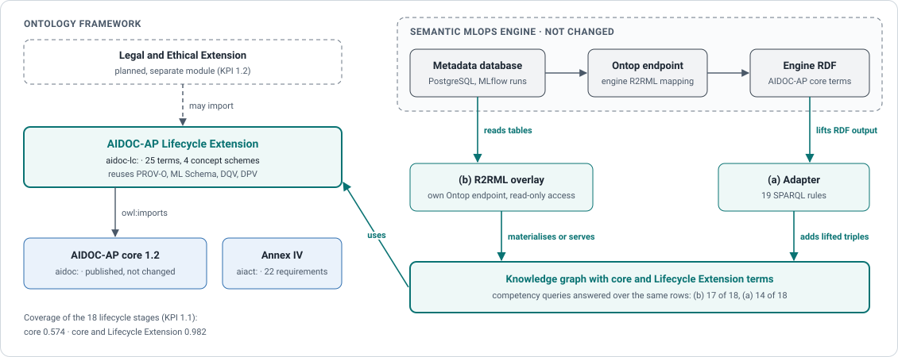
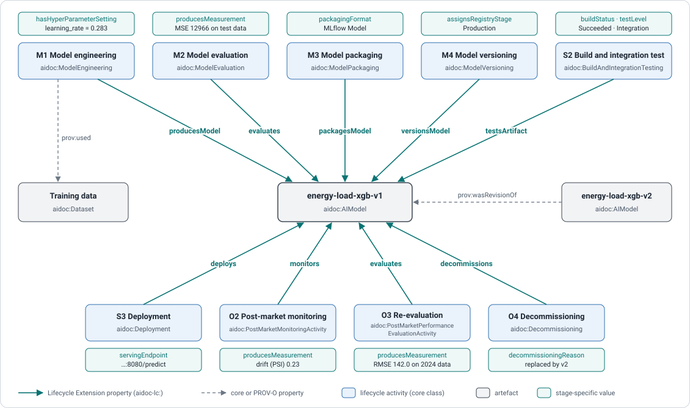

# AIDOC-AP Lifecycle Extension (aidoc-lc)

Extension module of the [AIDOC-AP](https://w3id.org/aidoc-ap) application profile, developed in the CERTAIN project (Horizon Europe, grant agreement 101189650). The AIDOC-AP core describes the technical documentation of AI systems required by Annex IV of the EU AI Act and has an activity class for each stage of the AI system lifecycle. The extension connects these activities to the artefacts they use and produce and gives each stage the properties needed to describe it: which training produced which model with which hyperparameter settings, how a model was packaged, versioned, tested, deployed, monitored, re-evaluated and decommissioned, and why. It imports the core without changing any of its definitions and reuses PROV-O, ML Schema, DQV and DPV.

Status: version 1.0, released on 6 October 2026.



| | |
|---|---|
| Namespace | `https://w3id.org/aidoc-ap/lifecycle#` (prefix `aidoc-lc`) |
| Ontology | [ontology/aidoc-lc.ttl](ontology/aidoc-lc.ttl): 2 classes, 19 object properties, 4 datatype properties, 4 seed concept schemes |
| Imports | AIDOC-AP core 1.2 |
| Documentation | [w3id.org/aidoc-ap/lifecycle](https://certain-project.github.io/aidoc-ap-lifecycle/): term reference, [worked examples](https://certain-project.github.io/aidoc-ap-lifecycle/examples.html), [coverage](https://certain-project.github.io/aidoc-ap-lifecycle/coverage.html) |
| Licence | CC BY 4.0 for the ontology and documentation ([LICENSE-CC-BY.txt](LICENSE-CC-BY.txt)), Apache-2.0 for code ([LICENSE](LICENSE)) |
| Citation | [CITATION.cff](CITATION.cff) |

## Example



The figure shows the model of the [energy pilot example](examples/energy_pilot_lifecycle.ttl). In Turtle, two of its stages read:

```turtle
@prefix aidoc: <https://w3id.org/aidoc-ap#> .
@prefix aidoc-lc: <https://w3id.org/aidoc-ap/lifecycle#> .
@prefix ex: <https://w3id.org/aidoc-ap/lifecycle/example/> .

ex:deployment-v1 a aidoc:Deployment ;
    aidoc-lc:deploys ex:energy-load-xgb-v1 ;
    aidoc-lc:servingEndpoint "http://energy-xgb.example.org:8080/predict"^^<http://www.w3.org/2001/XMLSchema#anyURI> .

ex:decommissioning-v1 a aidoc:Decommissioning ;
    aidoc-lc:decommissions ex:energy-load-xgb-v1 ;
    aidoc-lc:decommissioningReason "Replaced by energy-load-xgb-v2 which achieves 18% lower RMSE on the 2024 holdout set." .
```

[examples/](examples/README.md) holds the complete lifecycle of this model and a tokenization example; [cq/](cq/) holds one competency query per lifecycle question, each answered over the examples.

## Use with the Semantic MLOps Engine

The CERTAIN Semantic MLOps Engine publishes its metadata as RDF with the AIDOC-AP core. [mappings/](mappings/README.md) brings it to the terms of the extension without changing the engine: an adapter of SPARQL rules over the engine's RDF output, and an R2RML overlay for a separate Ontop endpoint over the engine database.

## Coverage of the lifecycle

The Ontology Coverage Index (CERTAIN KPI 1.1) tests each of 18 reference lifecycle stages for an activity class, a link to a typed artefact and a stage-specific property ([docs/02_oci_method.md](docs/02_oci_method.md)). The core alone reaches 0.574, core and extension 0.982. The grounding of every term in engine columns or cited sources is listed in [docs/grounding.csv](docs/grounding.csv).

## Working with the repository

```bash
make setup      # Python virtual environment; fetches the pinned AIDOC-AP core
make all        # module checks, tooling tests, coverage index, competency queries
```

| Command | Purpose |
|---|---|
| `make check` | module rules (`make check-strict` before a release) |
| `make oci-core`, `make oci` | coverage index of the core and of core plus extension |
| `make cq` | competency queries over the examples |
| `make alignments` | check the SKOS alignment proposals in `alignments/` |
| `make fetch-engine-excerpt` | fetch the pinned excerpt of the Semantic MLOps Engine |
| `make adapter-check`, `make overlay-check` | engine adapter and R2RML overlay (need the engine excerpt) |
| `make docs-pages` | worked examples and coverage pages of the documentation |
| `make release VERSION=1.0` | release files; see [RELEASE.md](RELEASE.md) |

| Path | Content |
|---|---|
| `ontology/` | the module |
| `cq/`, `examples/` | competency queries and example graphs |
| `alignments/` | SKOS alignment proposals |
| `mappings/` | adapter and R2RML overlay for the Semantic MLOps Engine |
| `documentation/` | Widoco configuration and introduction |
| `method/`, `docs/` | coverage index (reference model, criteria) and term grounding |
| `scripts/`, `tests/` | tooling and its tests |
| `release/` | w3id redirect rules |

Maintained by Sebastian Neumaier, University of Applied Sciences St. Pölten.
